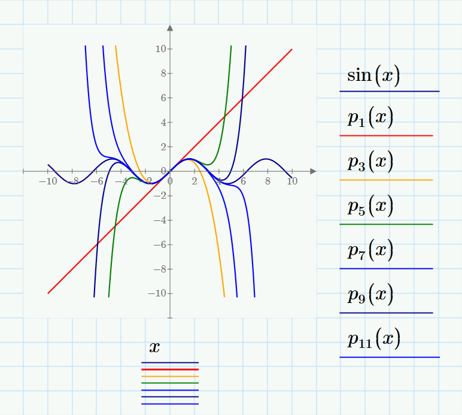
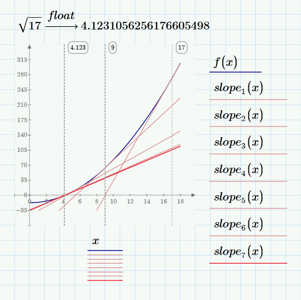

## Function Approximation

Custom approximations of cos, sin, sqrt.

## Features
- sin/cos - Maclaurin series.
- sqrt - Newton-Raphson.

## Documentation
/docs contains Mathcad projects with experiments, derivations and etc. for the Maclaurin series and Newton-Raphson.
